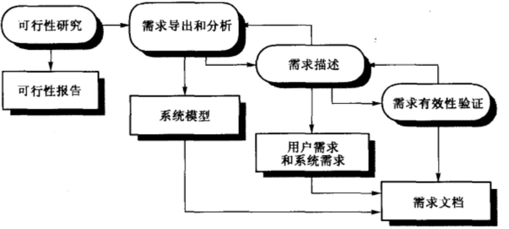
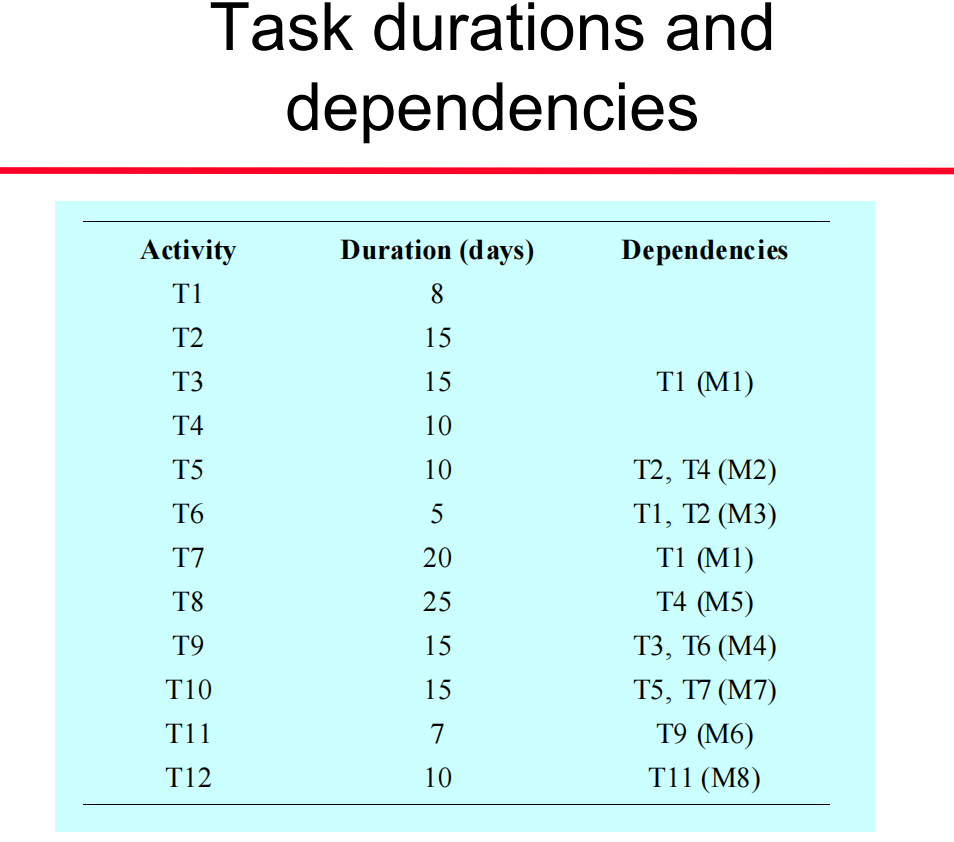
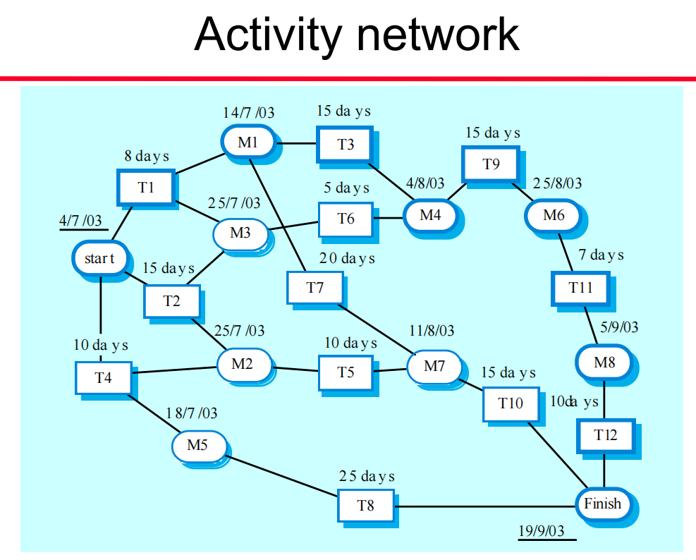
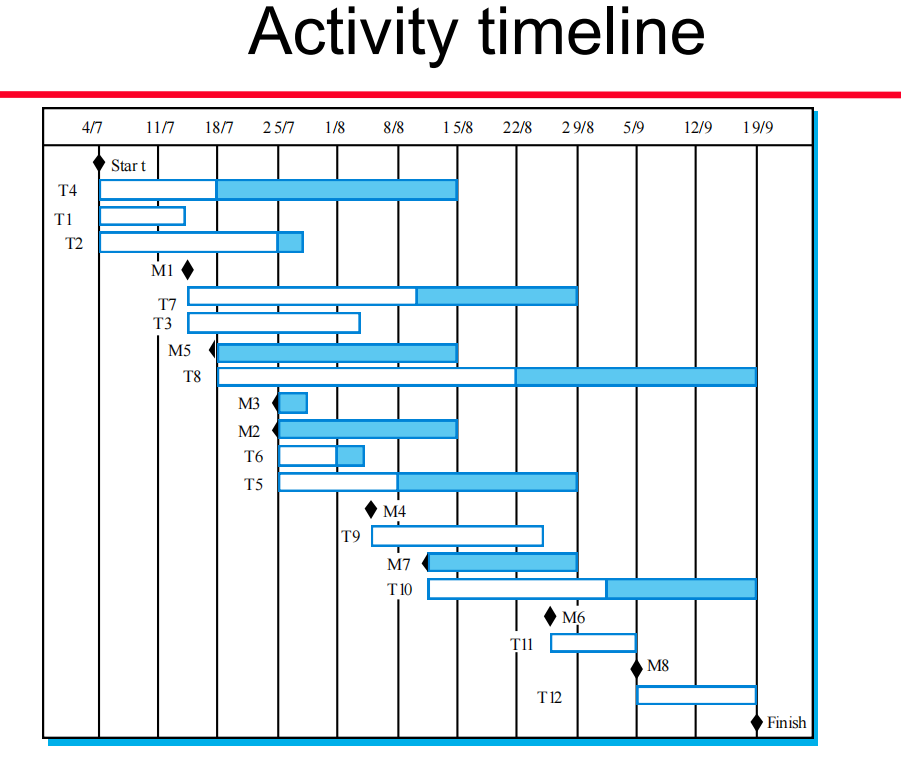
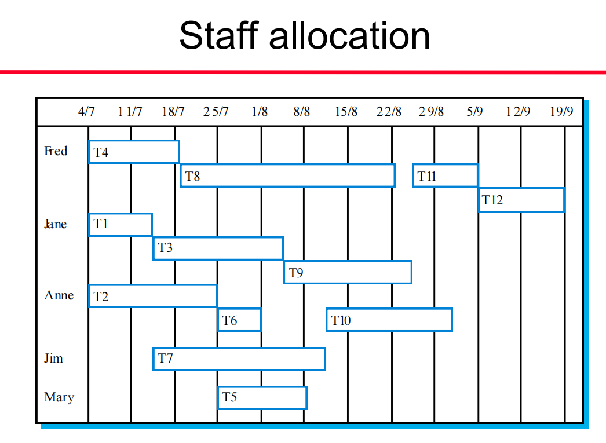
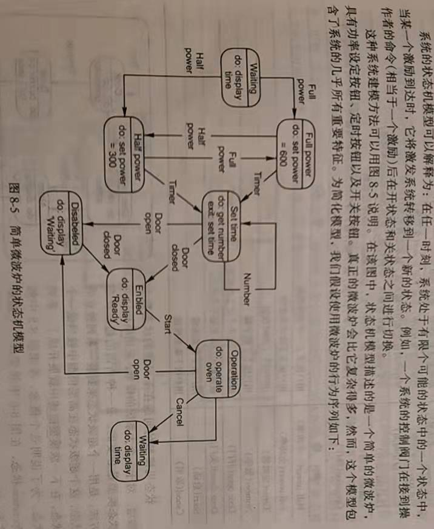

# 软件工程基础复习

### 题型

1. 填空

2. 判断

3. 名词解释 *4

4. 计算题 *2

   分析&设计

   planning

   画图+写字

5. 小作文题 / 论述题 *2

---

### 填空

#### 1. software process model（c4 软件过程）

三个基本的软件过程模型（Generic software process models）

1. 瀑布模型：采用一些基本的过程活动，使用单独的过程阶段表现这些活动 The waterfall model
2. 进化式开发：不断修改内容，先弄一个描述性的、快速开发出来的初始系统，根据客户要求慢慢改 Evolutionary development
3. 基于组件的软件工程：用很多开发好的组件，主要是集成，而不是从头开发 Component-based software engineering

General paradigms / models of software development 

#### 2. Difference between SE and other engineering（c1 概述）

软工和其他工程的区别

1. 与计算机科学的区别：计算机科学研究构成计算机和软件系统基础的有关理论和方法，软工研究软件制作过程中的实际问题

   软件工程人员常常**必须要特定的方法去开发软件**。对于实际、复杂的问题，计算机科学的经典理论不可能总是适用的，这时候就需要软件工程的方法来解决

2. 与系统工程的区别：系工比软工早出现。系统工程是基于计算机的系统工程，研究由软件起主导作用的、有关复杂系统的开发和进化的方方面面，包括**硬件开发、系统决策、过程设计、系统实施和软件工程**等。系统工程人员要做的事**描述这个系统，定义总的体系结构**，然后集成各个组建以完成整个系统。他们关注系统各组件（硬件、软件）的工程问题。

#### 3. Risk assessment （c5 项目管理）

风险评估

##### 可能性（Probability）

1. 非常小（10-）very low
2. 小（10-25）low
3. 中等（25-50）moderate
4. 大（50-75）high
5. 非常大（75+）very high

##### 严重程度（effects）

1. 灾难性的 catastrophic
2. 严重的serious
3. 可以容忍的tolerable
4. 可以忽略的insignificant

#### 4. Risk planning strategies（c5 项目管理）

风险规划策略

1. Avoidance strategies(规避策略)：降低风险出现的可能性
2. Minimisation strategies（最低风险策略）：减小风险的影响
3. Contingency plans（应急计划）：风险发生时适当应对

#### 5. Requirement engineering（c7 需求工程过程）

需求工程

1. Feasibility studies(可行性研究)
2. Requirements **elicitation** and analysis（需求导出和分析）
3. Requirements **specification** （需求描述）
4. Requirements validation（需求有效性验证）
5. Requirements management（需求管理）

#### 6. Important attributes of good product（Software attributes）（c1 概述）

1. 可维护性Maintainability：可以满足需求变化不断进化
2. 可依赖性Dependability：可靠性、保密性、安全性
3. 有效性Efficiency：不浪费系统资源
4. 可用性Acceptability：操作简单

#### 7. what is software（c1  概述）

计算机程序和相关文档，如要求、设计模型和用户手册。

软件产品可以为特定客户开发，也可以为一般市场开发。

可以通过开发新程序，配置通用软件系统或重用现有软件来创建新软件。

#### 8. 测试的两种分类？分别是做什么的？（c23 软件测试）

- Component testing 组件测试
  - -单个项目组件的测试;  

    -通常是组件开发人员的职责(有时关键系统除外);  

    —测试来源于开发人员的经验。  
- System testing 系统测试
  - -测试用于创建系统或子系统的组件组;  

    -独立测试团队的职责;  

    —测试基于系统规范。  

#### 9.  case tool（c4 软件过程）

计算机辅助软件工程

case工具是用来**支持软件过程活动**的软件。包括：**设计编辑器、数据字典、编译器、调试器、系统构建工具**等

**规划、编辑、测试、调试、编写文档、语言处理、程序分析、再工程、变更管理、配置管理、方法支持**

#### 10. component interface（c19 基于组件的软件工程）

基于组件的软件工程叫CBSE

组件是独立的并且是系统最基本的组成单元

- Provides interface 提供接口

  定义组件向其他组件提供的服务。

- Requires interface 需要接口

  定义系统其他组件必须提供哪些服务使组件工作

#### 11. re-engineering（c21 软件进化）

软件再工程关心的是通过对于遗留系统的改造使其**更易维护**

包括：

- 对系统重新建立文档
- 组织和调整系统
- 用一种更先进的程序设计语言转换系统
- 修改和更新系统的数据结构和值

行为有：

- Source code translation 源代码转换

  从旧的程序设计语言转换到相同语言的一个比较新的版本或另一种语言。

- Reverse engineering 反向工程

  对程序进行分析并从中抽取信息来记录它的结构和功能；

- Program structure improvement 程序结构改善

  对程序的控制结构进行分析和修改，使它更容易阅读和理解；

- Program modularisation 程序模块化

  程序的相关部分被收集在一起，在一定程度上消除冗余。

- Data re-engineering 数据再工程

  对程序处理的数据作改变以反映程序变更。

#### 12. project management（c5 项目管理）

项目管理

里程碑：milestone是一项软件过程活动的终结。进行项目规划时，建立一系列的项目里程碑，每个里程碑有一个正式的可以提交给管理层的输出结果，比如一个报告，可以不是大型文档而是简单报告。

可交付的文档：Deliverables是交付给客户的项目成果。可交付文档也可以是里程碑，但里程碑不需要交付，可交付文档面向的是客户，在项目的描述、设计等主要的项目阶段结束时交付。

#### 13. CORBA standards（c12 分布式系统体系结构，Distributed Systems Architectures）

corba是指通用对象请求代理体系结构

**应用对象模型**，其中一个CORBA对象实现了对**状态的一个封装**（encapsulation），对象具有语言无关（language-neutral)的接口，这些接口用IDL语言（接口定义语言interface definition language)）来描述

**对象请求代理**（ORB），负责对象服务**请求的管理**。由ORB来定位提供服务的对象、准备对象的服务、发送服务请求并向请求服务的对象返回结果。

一组**通用的对象服务**，这些服务是许多分布式应用普遍需要的。服务的例子有目录服务、交易服务和持久服务。                                                                                                                                                                                                                                                                                                                                                                                                                                                                                                                                                                                                                                                                                                                                                                                                                                                                                                                                                                                                                                                                                                                                                                                                                                                                                                                                                                                                                                                                                                                                                                                                                                                                                                                                                                                                                                                                                                                                                                                                                                                                                                                                                                                                                                                                                                                                                                                                                                                                                                                                                                                                                                                                                                                                                                                                                                                                                                                                                                                                                                                                                                                                                                                                                                                                                                                                                                                                                                                                                                                                                                                                                                                                                                                                                                                                                                                                                                                                                                                                                                                                                                                                                                                                                                                                                                                                                                                                                                                                                                                                                                                                                                                                                                                                                                                                                                                                                                                                                                                                                                                                                                                                                                                                                                                                                                                                                                                                                                                                                                                                                                                                                                                                                                                                                                                                                                                                                                                                                                                                                                                                                                                                                                                                                                                                                                                                                                                                                                                                                                                                                                                                                                                                                                                                                                                                                                                                                                                                                                                                                                                                                                                                                                                                                                                                                                                                                                                                                                                                                                                                                                                                                                                                                                                                                                                                                                                                                                                                                                                                                                                                                                                                                                                                                                                                                                                                                                                                                                                                                                                                                                                                                                                                                                                                                                                                                                                                                                                                                                                                                                                                                                                                                                                                                                                                                                                                                                                                                                                                                                                                                                                                                                                                                                                                                                                                                                                                                                                                                                                                                                                                                                                                                                                                                                                                                                                                                                                                                                                                                                                                                                                                                                                                                                                                                                                                                                                                                                                                                                                                                                                                                                                                                                                                                                                                                                                                                                                                                                                                                                                                                                                                                                                                                                                                                                                                                                                                                                                                                                                                                                                                                                                                                                                                                                                                                                                                                                                                                                                                                                                                                                                                                                                                                                                                                                                                                                                                                                                                                                                                                                                                                                                                                                                                                                                                                                                                                                                                                                                                                                                                                                                                                                                                                                                                                                                                                                                                                                                                                                                                                                                                                                                                                                                                                                                                                                                                                                                                                                                                                                                                                                                                                                                                                                                                                                                                                                                                                                                                                                                                                                                                                                                                                                                                                                                                                                                                                                                                                                                                                                                                                                                                                                                                                                                                                                                                                                                                                                                                                                                                                                                                                                                                                                                                                                                                                                                                                                                                                                                                                                                                                                                                                                                                                                                                                                                                                                                                                                                                                                                                                                                                                                                                                                                                                                                                                                                                                                                                                                                                                                                                                                                                                                                                                                                                                                                                                                                                                                                                                                                                                                                                                                                                                                                                                                                                                                                                                                                                                                                                                                                                                                                                                                                                                                                                                                                                                                                                                                                                                                                                                                                                                                                                                                                                                                                                                                                                                                                                                                                                                                                                                                                                                                                                                                                                                                                                                                                                                                                                                                                                                                                                                                                                                                                                                                                                                                                                                                                                                                                                                                                                                                                                                                                                                                                                                                                                                                                                                                                                                                                                                                                                                                                                                                                                                                                                                                                                                                                                                                                                                                                                                                                                                                                                                                                                                                                                                                                                                                                                                                                                                                                                                                                                                                                                                                                                                                                                                                                                                                                                                                                                                                                                                                                                                                                                                                                                                                                                                                                                                                                                                                                                                                                                                                                                                                                                                                                                                                                                                                                                                                                                                                                                                                                                                                                                                                                                                                                                                                                                                                                                                                                                                                                                                                                                                                                                                                                                                                                                                                                                                                                                                                                                                                                                                                                                                                                                                                                                                                                                                                                                                                                                                                                                                                                                                                                                                                                                                                                                                                                                                                                                                                                                                                                                                                                                                                                                                                                                                                                                                                                                                                                                                                                                                                                                                                                                                                                                                                                                                                                                                                                                                                                                                                                                                                                                                                                                                                                                                                                                                                                                                                                                                                                                                                                                                                                                                                                                                                                                                                                                                                                                                                                                                                                                                                                                                                                                                                                                                                                                                                                                                                                                                                                                                                                                                                                                                                                                                                                                                                                                                                                                                                                                                                                                                                                                                                                                                                                                                                                                                                                                                                                                       

一组**通用组件**，这些组件是建立在应用需求的基本服务之上的。这些组件可能是垂直领域的相关组件或水平的适用于许多应用的通用组件。

#### 14. people management（c25 人员管理）

人的管理，人的三种类型（为生存而工作、为兴趣而工作、为沟通而工作）

面向任务型：Task-oriented

The work is a means to an end which is the achievement of individual goals - e.g. to get rich, to play tennis, to travel etc.

这类人的动力主要来自个人成功和社会认同。他们更乐于把软件开发视为自己达到目的的手段

面向自我型：Self-oriented

The motivation for doing the work is the work itself

这类专业人员的动力来自于他们所从事的工作。在软件工程中，他们是技术人员，软件开发智力上的挑战激发了他们的工作热情。

面向交互型：Interaction-oriented

The principal motivation is the presence and actions of co-workers. People go to work because they like to go to work

这类人的动力来自于同事的存在和行动

#### 15. reuse（c18 软件复用）

基于复用/组件的开发是基于什么样的需求而采用的

- achieve better software, more quickly and at lower cost

  降低软件产品和维护的成本、更快的系统移交以及提高软件质量的要求

基于复用的开发方式是为了：

1. 降低软件产品和维护的成本
2. 更快的的系统移交
3. 提高软件质量要求

优点：

1. 增加可靠性
2. 降低过程风险
3. 专家有效使用
4. 与标准兼容
5. 加快开发速度

缺点：

1. 增加维护成本
2. 缺乏工具支持
3. 孤芳自赏
4. 维护一个组件库
5. 查找和改编可复用组件

#### 16. evolutionary development（c4 软件过程）

进化式开发：先开发出一个原型系统给用户使用，通过用户反馈意见来不断修改，直至最后成熟

- Exploratory development（探索式开发）

  Objective is to work with customers and to evolve a final system from an initial outline specification. Should start with well-understood requirements and add new features as proposed by the customer.

  目标是与客户合作，共同探索系统需求，直到最后交付系统。从需求比较清楚地部分开始，根据用户的建议逐渐向系统中添加功能。

- Throw-away prototyping（抛弃式原型）

  Objective is to understand the system requirements. Should start with poorly understood requirements to clarify what is really needed.

  目标是理解用户需求，然后再给出系统的一个较好的需求定义。原型着重对客户需求理解较差的那部分的实验。*（目标是了解系统要求。应从不甚了解的需求开始，以明确真正需要的是什么。）*

#### 17. （补充资料）传统结构化分析方法的主要模型

A range of different models may be produced during an conventional structured design process. These include static models (_  data dictionary     _, _ ERD(entity-relationship diagram)     __) and dynamic models (__  DFD(data flow diagram)   _  __, __  STD(state transition diagram)       _). 

Three parts:

1)Data Modelling

2)Process Modelling

3)Behavior Modelling

#### 18.  object orient design（c14 面向对象的设计）

面向对象分析方法

面向对象分析方法的主要模型

- 分为两大类：静态模型和动态模型

- 静态模型

  Static models describe the static structure of the system in terms of object classes and relationships.

  通过系统对象类及其之间的关系来描述系统的静态结构。

- 动态模型

  Dynamic models describe the dynamic interactions between objects

  描述系统的动态结构和系统对象（不是对象类）之间的交互

实例：

子系统模型：

Sub-system models that show logical groupings of objects into coherent subsystems.

说明对象的逻辑分组，每个分组构成一个子系统。使用类额的图表格式来表示，每个子系统以一个包的形式存在。子系统是静态模型

序列模型：

Sequence models that show the sequence of object interactions.

说明对象的交互序列。使用UML序列图或协作图表示。序列模型是动态模型

状态机模型：

State machine models that show how individual objects change their state in response to events.

说明单个对象如何相应事件来改变他们的状态。使用UML的状态图来表示。状态机模型是动态模型

#### 19. iterative process model（c4 软件过程）

Process iteration

过程反复模型：反映软件过程是一个循环活动，好处是允许对系统描述或设计的进一步修改

- 增量式开发模型：软件描述、设计和实现活动被分散为一系列增量，然后轮流开发这些增量
  - 客户的价值可以通过每一个增量来实现，所以系统功能可以更早的实现。 
  - 早期的增量作为一个原型（prototype），有助于为以后的增量引出（elicit）需求。 
  - 降低整个项目失败的风险。 
  - 最优先的系统服务往往会得到最多测试。
- 螺旋式模型：系统的开发从一个初始的大纲开始，螺旋状开发，直到最后形成完善的系统
  - 目标设置
  - 风险评估和规避
  - 开发和有效性验证
  - 规划

#### 20. 检验和有效性验证（c22 检验和有效性验证）

- Validation 有效性验证

  The software should do what the user really requires.

- Verification 检验

  The software should conform to its specification.

  软件应该符合它的规范。  

#### 21. PCMM模型

人员管理那章25 People Capability Maturity Model **人员能力成熟度模型**

 Five stage model **• Initial**. Ad-hoc people management • **Repeatable.** Policies developed for capability improvement • **Defined.** Standardised people management across the organisation • **Managed**. Quantitative goals for people management in place • **Optimizing.** Continuous focus on improving individual competence and workforce motivation

- 初始级——特定的、非正规的人员管理实践
- 可重复级——制定政策，开发员工的能力
- 已定义级——使得整个机构的成功的人员管理实践标准化
- 已管理级——制定并引入量化了的人员管理目标
- 优化级——时刻注意提高个人能力和端正工作动机

### 判断

#### social technical system

PPT+书ch10

- 一个包含有人、软件和硬件在内的系统（是一种包含软硬件组件、对人的操作过程有良好定义的在组织内部运行的系统，收到机构的决策、规程及结构的影响）
- 层次化结构：
  1. 设备层
  2. 操作系统层
  3. 通信和数据管理层
  4. 应用层
  5. 业务过程层
  6. 机构层
  7. 社会层

1. Emergent properties

   系统的整体特性，依赖于系统组件及其之间的关系。

   信息安全性和可靠性属于整体特征。

   - 功能特性

     在系统的所有组件集成后系统目的才表现出来

     e.g. 自行车

   - 非功能特性

     与系统在其运行环境的行为有关（可靠性、安全性）

     - 硬件可靠性
     - 软件可靠性
     - 操作员可靠性

2. Non-deterministic

   人为因素导致系统随机性

3. Complex relationships with organisational objectives

   系统支持机构目标的程度和范围不仅仅依赖于系统本身。它往往还依赖于这些目标的稳定性，机构目标之间的关系和冲突，以及机构中人员是如何解释这些目标的。

   成功的系统可能会因为目标的变换变成失败的系统。

#### Wicked problem

对SE的疑难问题 连问题都定义不清的

P173 ch10.1.3

含义：这类问题非常复杂，具有非常多的关联实体，且无法给出问题的确切描述。

只有当解决办法有了之后这类问题的本质才会暴露出来。

e.g. 地震预报

#### CASE technology

P22+PPT

计算机辅助软件工程：用来支持软件工程过程活动的程序。

设计编译器、数据字典、编译器、调试器、系统生成工具

CASE分类标准

- Functional perspective
- Process perspective
- Intergrantion perspective

#### Component-based SE

ch17

- 独立组件由他们的接口完全定义。
- 组建标准
- 中间件（支持）
- 开发过程

原则：->易于理解、可维护

1. 组件是独立的
2. 组件通过良好的接口进行交互
3. 组件基础设施提供标准服务

##### 组件与对象的区别

不像对象类，组件是可以独立部署的，不定义类型，与语言无关，且机遇标准的组件模型

##### 组件的接口：

1. 需要接口
2. 提供借口

##### 组件模型

1. 接口
2. 使用信息
3. 部署和使用

##### CBSE过程

- 面向复用的开发
- 基于复用的开发

##### 组件合成

- 顺序合成
- 层次合成
- 叠加合成

#### Sequence diagram / state machine diagram

- 时序图 P78

  在特定用例中的交互发生顺序。

- 这个就看书上或者PPT上的例子吧

#### Fat-client 

P311

胖客户机模型中，服务器只需要负责数据管理（data management），在客户端的软件负责用户的应用逻辑处理与交互（locally）。

- 相较于瘦客户机模型负载在**管理**。新版本必须要安装给全部的客户机。
- 服务器相当于一个事物服务器，管理所有的数据库事务。不需要和用户交互。
- 举例：ATM系统

胖客户机 v.s. 瘦客户机

- 胖客户机在分布处理上更有效
- 胖客户机系统管理更复杂

PS：小学期做的是thin client model

#### Check List

书上均以例子的形式出现，就都差不多是这种图

- 方便审查（inspection） P442

  同行审查，工作交接

- 检查

  危险分析中的审查和核对表技术 P199

- 安全

  P256 信息安全检查表

#### Reuse costs & problem

- 增加维护成本
- 缺乏工具支持
- 孤芳自赏
- 创建维护和使用一个组件库
- 查找、理解和改编可重用组件

#### Critical Path

> The critical path is the longest path (in terms of the time required to complete the tasks) through the activity chart. The critical path defines the minimum time required to complete the project.

活动图

最长的依赖任务序列，决定了项目的持续时间

#### PPT - > Cdinality  / Cardinality / Modality

- cardinality

  是一个对象可以和另一个对象之间存在的联系的数量

  - 1:1
  - 1:n
  - M:n

- Modality

  - 0:关系是非必须的/可选的
  - 1:关系是强制的

#### ERD DFD STD

- ERD：entity/relationship diagram

  - 数据对象
  - 属性
  - 关系
  - 不同类型的指示器

  

- DFD：data flow diagram

  信息流 input->output

  分割成不同等级 information flow + functional detail

  

- STD：state transition diagram

  表示系统被其状态和时间描述的行为导致系统行为的该表 Behavior Modelling

  > The STD indicates what actions are taken as a consequence of a particular event.

  

### 名词解释

#### 1.nonfunctional requirement/functional requirement（c6 软件需求）

- Functional requirement

  包括对系统应该**提供的功能或系统服务**、如何**对输入做出反应**以及系统在**特定条件下的行为**的描述。在某些情况下，功能需求可能还需声明系统**不应该做什么**。

  应该具有**全面性和一致性**

  取决于**软件类型**、软件**未来的用户**和**开发的系统类型**。

  如果是**用户需求**，就用较**一般的描述**给出，若**功能性的系统需求**，则需要**详细的描述**系统功能、输入和输出、异常等。

- Non-functional requirement

  指那些**不直接与系统具体功能相关的一类需求。**与系统的**总体特征**相关，一般用于整个系统，而不是某一部分，如可靠性、反应时间和存储空间等。

  **检验较为困难。**

  对系统提供的服务或功能给出的**属性和约束**。包括时间约束、I/O设备的能力、系统界面中的数据的表示、开发过程的约束、标准等。

  不只是与软件系统本身有关，还与系统的**开发过程**有关

  **源于用户的限制**，包括**预算**上的约束、**机构政策**、**与其他软硬件系统**间的互操作，还包括**安全规章、隐私权保护的立法**等外部因素。

  非功能性需求可能比功能性需求**更为关键**。如果不满足这些条件，系统将毫无用处。

#### 2.product line（c18 软件复用）

**复用最有效的方法之一是创建软件产品线或应用族。产品线是一组应用，他们有相同的应用专门的体系结构**。

软件产品线（**产品线的四种实例化方式**）

- Platform specialisation 平台特化

  为不同的**平台**开发应用程序的不同版本

- Environment specialisation 环境特化

  创建应用的版本来处理特殊的**操作环境和外部设备**

- Functional specialisation 功能特化

  为**不同需求的客户**创建不同的应用程序版本

- Process specialisation 过程特化

  调整系统使之与**特殊的业务过程**配套

软件产品线的设计使用来配置的，可以在**部署时配置**也可以在**设计时配置**。

#### 3.design pattern（c18 软件复用）

设计模式：将**应用间所发生的一般抽象**表示为设计模式，设计模式**给出了抽象和具体对象的交互**

- 模式是对问题和解决方案的基本内容的描述

- 它应该足够抽象以便在不同的环境中重用

- 模式通常依赖于对象特性（如继承和多态）来支持它的通性

- 设计模式的四个主要元素：

  - 名字：是模式的有意义的**指代**
  - 问题描述：解释**什么时候模式**可以应用
  - 解决方案描述：描述设计方案的各个部分及其之间的关系和职责。它不是一个具体的设计描述，而是一个**设计方案的模板**，可以用不同的方式实例化
  - 结果陈述：说明应用该模式的**结果和折衷**

#### 4.incremental development（c4 软件过程）

增量式开发

- **软件描述、设计和实现活动**被分散成一系列的增量，然后轮流开发这些增量
- 增量开发过程中，**客户大概地提出**系统需要提供的服务，指明哪些服务是最重要的，哪些是最不重要的。
- 此时，一系列交付增量被确定，每个增量提供系统功能的一个子集。对增量中服务的分配取决于服务的优先次序。最高优先权的服务首先被交付。
- 开发时，为稍后的增量准备的**需求分析不断进行**，但对**目前增量的需求变更不会被接受**

优点：

- 客户无需等到整个系统的实现。第一个增量会满足他们大多数的关键需求，因此软件**马上就能使用**。 
- 客户可以将早期的增量作为原型（prototype），从中获得对后面系统增量的需求**经验**
- **降低整个项目失败的风险。** 
- 最优先的系统服务往往会得到最多**测试**。

问题：

1. 增量相对较小，因此很难把需求映射到**适当规模**的增量上
2. 大多数系统需要基本服务，由于增量实现前不能被详细定义，**明确所有增量会用到的基本服务**会比较困难

#### 5.distributed object architectures（c12 分布式系统体系结构）

分布式对象体系结构

在分布式对象体系结构中，客户端和服务器之间**没有区别**。

每个可分布的实体都是一个对象，它可以向其他对象**提供服务**，也可以从其他对象**接收服务**。接受的就是客户机，提供的就是服务器。

对象可能分布在网络中的多个计算机上，**对象通信是通过一个称为对象请求代理的中间件系统**进行的，其作用是在对象之间提供一个无缝接口，允许对象之间通信和往系统上添加和移走对象。

优点：

1. 允许系统设计者**延迟决断在哪里和如何提供服务**
2. 是一个开放体系结构，允许**新的资源**根据需要增加进来
3. 有很好的**柔性和可扩缩性**
4. 通过**对象在网络上的迁移**达到对系统的**动态重配置**是有可能的。                                                                                                                                                                 

#### 6.C/S architecture（c12 分布式系统体系结构）

**由一个服务集合和相关的服务器以及访问和使用这些服务的客户机组织起来的。**

主要组成：一组给其他组件提供服务的**服务器**、一组向服务器请求服务的**客户机**、一个连接客户机和服务器的**网络。**

系统的**功能是以服务的形态存在的**。每一个服务来自于某个**单独的服务器**，当需要从很多地点访问共享数据时使用，因为服务器可以复制，所以也可以在系统负载经常变化时使用。

优点是服务器**可以分布到网络上**，缺点是对于**阻止拒绝服务攻击或服务器失败缺乏免疫性**。

- 客户端知道服务器，但服务器不需要知道客户端。

- 服务器和客户机是指**逻辑的进程**而不是指物理计算机

- 进程和处理机之间没有必要非得一对一地映射，几个服务器进程可以在单个服务器处理器上运行

瘦客户机：应用处理和数据管理都在服务器上执行，客户机负责表示。Thin client model

胖客户机：服务器只负责对数据管理，客户机实现应用处理和表示。fat

胖客户机比瘦客户机有效但是复杂

#### 7.checklist（c22 检验和有效性验证）                                                                                                                                                                                                 

软件审查（inspection）时的checklist（Inspection checklists）

应使用常见错误的检查表来驱动检查，**由有经验的开发人员经过讨论建立**。

对**不同的程序设计语言**需要准备不同的审查清单，因为不同的语言有不同的错误特征。

一般来说，**类型检查“越弱”，检查表就越大**。

应基于**局部标准和实践经验**，并伴随着新的缺陷类型的发现不断的**更新**清单

示例：初始化、常数命名、循环终止、数组边界等

审查内容：数据缺陷、控制缺陷、输入输出缺陷、接口缺陷、存储器管理缺陷、异常管理缺陷

#### 8.UML sequence diagram

序列图：

是Interaction diagram（交互图）的一种，交互图是描述对象之间的关系和对象之间的信息传递的图。通常用来描述一个用例的行为，实现一个用例，完成对系统的动态行为建模。

序列图是按照时间顺序显式对象之间交互的图。

由四部分组成：

1. **活动者（actor）或者 对象（object）** ：活动者和对象按照从左到右的顺序排列，一般**最多两个活动者**，他们分列两端。启动这个用例的活动者往往排在最左边；接收消息的活动者则排在最右端； 对象从左到右按照重要性排列或按照消息先后顺序排列。
2. **生命线（lifeline）**：每个对象都有自己的生命线，用来表示在该用例中一个对象**在一段时间内的存在**。垂直的虚线。如果对象生命期结束，则用注销符号表示。对象默认的位置在图顶部，表示对象在交互之前已经存在。如果是在交互过程中由另外的对象所创建，则位于图的中间某处。 
3. **激活(activation)/ 控制焦点（focus of control）** ：对象在一段时间内获得了焦点，也称激活期。对象执行某个动作的时期。空心矩形条。激活期的长短意味着对象**执行某个动作的时间有多长**，可以通过约束{10ms}来限制执行时间的长短。
4. **消息（message）**：面向对象方法中，消息是对象间交互信息的主要方式。结构化程序设计中，模块间传递信息的方式主要是**过程（或函数）调用**。对象A向对象B发送消息，可以简单地理解为对象A调用对象B的一个操作（operation）。

建立序列图的步骤：

1. 确定交互的范围；
2. 识别参与交互的对象和活动者；
3. 设置对象生命线开始和结束；
4. 设置消息；
5. 细化消息；

#### 9.middleware services

组件模型中，中间件提供的几种基础服务：

中间件为组件集成提供软件支持。为了使独立的分布式的组件一起工作，需要有支持组件之间交互的中间件。例如CORBA可以有效处理低层问题，这样就允许我们集中精力来处理应用相关的问题。此外实现组件模型的中间件可以对资源分配、事务管理、信息安全及并发的支持。

中间件是管理分布式系统不同部分、确保它们能通信和交换数据的软件，位于系统的不同分布式组件之间。中间件通常实现为一系列库，这些库被安装到每一个分布的计算机上，加上一个运行时系统管理通信。提供两种不同支持，一是交互支持，即协调系统中不同组件之间的交互；二是提供公共服务，即中间件提供对服务的可复用的实现。

#### 10.legacy system（c2 社会技术系统）

遗留系统

遗留系统是以**计算机为基础的社会-技术系统**，他们是在过去开发出来的，往往采用在今天看来是旧的或者不再使用的技术。这些技术不仅包括**软件和硬件**，还包括遗留的**过程和手续**，由于依赖遗留软件而很难加以改变。对此类系统中的一部分的改变都会带来对其他组件的改变。

遗留系统**限制了新的业务流程**，并消耗了很高比例的公司**预算**。

遗留系统通常都是**关键**性业务系统，维护原因是因为**更换风险太大**。

包括系统硬件、支持软件、应用软件、应用数据、业务过程和业务策略和规则

**维护层之间的接口**，接口得到维护的话层内部的改变就不会相互影响，但更可能的是上下都要改变。

#### 11.equivalence partition（c23 软件测试）

等价类划分：

等价划分是一种**发现测试用例的方法**——分区中的所有用例都应该以相同的方式运行。

输入数据和输出结果通常**属于不同的类**，每个类都是**等价分区**，程序对每个类成员以**等价的方式运行**。

从**每个分区中选择**测试用例。

#### 12.黑盒测试和白盒测试（c23 软件测试）

##### 黑盒测试

发布测试（release testing）通常是一个黑盒测试的过程

测试从系统描述导出。系统被作为一个黑盒子，行为只能通过输入和相应输出确定。

又叫**功能测试**，因为只关心功能不关心实现。

通过输入导致反常行为的输入，得到暴露出缺陷的输出，当输出与预期不符，就发现了一个缺陷。

##### 白盒测试

结构化测试（structural testing）又被叫做白盒测试

根据软件的**结构知识和实现知识**导出测试用例设计方法。

#### 13.independent path（c23 软件测试）

独立路径：

路径测试是一种结构化测试策略，其目标是要执行组件或程序中的每一条执行路径。

**独立路径是指在流程图中至少穿越一条新边的路径，即包括若干未曾处理的语句或条件的一条路径**。

如果每一条独立路径都执行过，那么组件中的每条语句肯定至少执行过一遍。

*环路复杂性=边数-点数+2=控制流图中的区域数（注意要算最外面的）=判定节点数+1*

#### 14.difference between object and object class

对象和对象类的差别        

- 对象是软件系统中的实体，代表现实世界和系统实体的实例。

- 对象类是对象的模板。它们可用于创建对象。

- 对象类可以从其他对象类继承属性和服务。

对象是具有状态和一组对该状态进行操作的定义操作的实体。该状态被表示为一组对象属性。与对象相关联的操作向其他对象（客户端）提供服务，这些对象在需要某些计算时请求这些服务。对象是根据某些对象类的定义来创建的。对象类定义可作为对象的模板。它包括应该与该类的对象关联的所有属性和服务的声明。

#### 15.re-engineering（c21 软件进化）

软件再工程关心的是通过对于遗留系统的改造使其**更易维护**

包括：

- 对系统重新建立文档
- 组织和调整系统
- 用一种更先进的程序设计语言转换系统
- 修改和更新系统的数据结构和值

行为有：

- Source code translation 源代码转换

  从旧的程序设计语言转换到相同语言的一个比较新的版本或另一种语言。

- Reverse engineering 反向工程

  对程序进行分析并从中抽取信息来记录它的结构和功能；

- Program structure improvement 程序结构改善

  对程序的控制结构进行分析和修改，使它更容易阅读和理解；

- Program modularisation 程序模块化

  程序的相关部分被收集在一起，在一定程度上消除冗余。

- Data re-engineering 数据再工程

  对程序处理的数据作改变以反映程序变更。

#### 16.MVC model（c18 软件复用）

在应用框架（Application frameworks）部分中，提到了MVC framework

框架是一个子系统设计，包含抽象类和具体类的集合以及这些类之间的接口。框架通常是多个模式的实例化。应用通常是需要集成多个框架来构造的。

**模型-视图-控制器框架：**

最著名且应用最广的GUI框架

允许对象的**多个表示形式**存在，允许对不同表示形态的对象采用**不同风格的交互形式**。

MVC框架包括**观察者模式、策略模式、组合模式**以及**其他**多个模式

模型－视图－控制器（MVC）。将表示和交互从系统数据中分离出来。

系统被设计成由3个彼此交互的逻辑组件组成：**模型组件**管理系统数据和在数据上的操作，**视图组件**定义和管理如何显示数据给用户，**控制器组件**管理用户的交互（如键按下，鼠标点击），并传递这些交互给视图和模型。

优点是**允许数据独立地改变**，不影响表示，反之亦然，支持对相同数据的多种不同方式的表达，对某种表示的变更会传递到其他所有表示。

但可能需要**额外的代码**，当数据模型和交互很简单时代码的**复杂度相对较高**。

### 设计题

第八章

考设计图、状态图 画两个图

书上的微波炉状态图、有可能考个洗衣机

#### Bar charts and activity networks

项目调度中的条形图和活动网络图

#### state machine model（Data collection sequence）

#### state transition diagram（Statecharts）

#### UML sequence diagram

### 问答题

#### 1.the advantages and disadvantages of the waterfall model（c4 软件过程）

瀑布模型的优势和劣势

瀑布模型：采用一些基本的过程活动，使用单独的过程阶段表现这些活动

包含5个阶段：需求分析和定义，系统和软件设计，实现和单元测试，集成和系统测试，运行和维护

原则上每个阶段要生成文档，检验通过再开始下一个。但是由于实际上阶段之间会存在重叠和信息交换，因此不是简单线性模型，而是包含反复。

生成文档成本很高，反复昂贵且费时，在少量反复之后要冻结部分开发过程，出现问题忽略或者再想办法。

最后进入运行和维护时暴露出的问题要重复进行一些过程，进行变更和进化。

优势：它在每个阶段都生成文档，而且它与其他工程过程模型相一致。

劣势：它将项目生硬地分解成这些确切的阶段。委托事项一定要在过程的早期阶段清晰给出，而这意味着它难以相应用户需求的变更。

只有在全面理解需求，而且在系统开发过程中不太可能发生重大改变的时候，应该采用瀑布模型。然而，瀑布模型反映了在其他工程项目中使用的过程模型类型。所以，基于该方法的软件过程仍然用于软件开发，油漆当软件项目是大型系统工程项目中的一部分的时候。

#### 2.the 4 elements of conventional structural design process, and the reason wht it is still being used（c8 系统模型+补充材料）

传统结构化设计方法四要素：

 Data dictionary（数据字典）

 Entity relationship diagram;E/R图（实体-关系图）

 Data flow diagram（数据流图）

 State transition diagram（状态转换图）

至今仍在使用的原因：

1. 能十分有效地降低成本，因为采用标准符号系统，保证标准设计文档的产生
2. 按照模块划分原则赋予程序可读性和易维护性、可调性和可扩充性
3. 整体思路清楚，目标明确。
4. 设计工作中阶段性非常强，有利于系统开发的总体管理和控制。
5. 在系统分析时可以诊断出原系统中存在的问题和结构上的缺陷。
6. 适用于程序规模较大的开发任务
7. 实践中工程师和设计人员可以不拘泥于特别的模型中，但是单作为需求分析的一部分时，模型通常是有用的，能够展现系统中端到端处理的总体面貌，也能在对象识别和对象操作识别上有直接贡献。
8. 具有广泛的case工具支持

#### 3.Spiral development（c4 软件过程）

螺旋式迭代模型（理解该模型嵌入其他模型的过程）

 不是讲软件过程用一系列活动和活动间的回溯来表示，而是将过程用螺旋线表示。

螺旋线中每一个回路表示软件过程的一个阶段

最里面的回路可能与系统可行性有关，下一个回路与系统需求定义有关，等等

- Process is represented as a spiral rather than as a sequence of activities with backtracking

  过程表示为螺旋，而不是回溯的一系列活动。

- Each loop in the spiral represents a phase in the process.

  螺旋中的每个循环代表过程中的一个阶段。

- No fixed phases such as specification or design - loops in the spiral are chosen depending on what is required.

  根据需要，不会选择固定的阶段，例如规格或螺旋中的设计循环。

- 每个螺旋线中每个回路被分成四个部分：

  - Objective setting 目标设定

    Specific objectives for the phase are identified.

    确定该阶段的具体目标。

  - Risk assessment and reduction 风险评估和规避

    Risks are assessed and activities put in place to reduce the key risks.

    对风险进行评估，并开展活动以减少关键风险。

  - Development and validation 开发和有效性验证

    A development model for the system is chosen which can be any of the generic models.

    在风险预估以后，就可以为系统选择开发模型。

    举例来说，如果用户界面风险时主要的，一个适当的开发模型可能是建立进化式原型。如果安全风险时主要的，则基于形式化转换的开发可能就是适当的。如果主要风险在于子系统集成，那么瀑布模型可能是最适当的。

  - Planning 规划

    The project is reviewed and the next phase of the spiral is planned.

    对项目进行评审以确定是否需要进入螺旋线的下一个回路。如果决定继续，则要做出项目的下个阶段计划。

与其他软件过程模型之间的重要区别在于，螺旋式模型中的风险考虑是明确的。

螺旋式模型的一个回路始于如性能、功能等关心的目标，达到这些目标的可能方式以及对于这些方式的约束在这时要全部列出。每个目标所有可选方案进行评估，识别出风险源头。

#### 4.对软件复用、基于组件式的开发的理解（十八、十九章）

- In most engineering disciplines, systems are designed by composing existing components that have been used in other systems

  在大多数工程学科中，系统是通过组合已在其他系统中使用的现有组件来设计的。

- Software engineering has been more focused on original development but it is now recognised that to achieve better software, more quickly and at lower cost, we need to adopt a design process that is based on systematic software reuse.

  软件工程更注重原始开发，但现在人们认识到，为了更快、更低地实现更好的软件，我们需要采用基于系统软件重用的设计过程。

绝大多数工程学科中的设计过程都是对于现成的系统和组件的复用。

基于服用的软件工程是一个类似的软件工程策略，使开发过程适应对现存软件的复用。近十年中才渐渐从最早的软件开发方式转变到基于复用的开发方式上来。

基于复用的开发方式是为了：

1. 降低软件产品和维护的成本
2. 更快的的系统移交
3. 提高软件质量要求

优点：

1. 成本降低
2. 增加可靠性
3. 降低过程风险
4. 专家有效使用
5. 与标准兼容
6. 加快开发速度

缺点：

1. 增加维护成本
2. 缺乏工具支持
3. 孤芳自赏
4. 维护一个组件库
5. 查找和改编可复用组件

基于复用的软件工程已经变成了主要的开发手段。这些可复用的实体从细粒度的函数到整个应用系统都有。然而直到最近，中等粒度的程序组件再利用仍十分困难。中等粒度组件比单个的对象或过程要大得多，有更多的功能，但是它们比应用系统要小也更特殊。


基于组件的软件工程（CBSE）是软件系统开发的基于复用的方法

单个对象类太细节且太特殊，且通常需要在编译时间与应用绑定。我们必须了解类的详细的知识以便于应用它们。一般来讲，这意味着不得不掌握组件的源代码。这使得将对象作为一种可复用组件出售变得很困难。


CBSE是定义、实现和集成或组合松散耦合的独立组件成系统的过程。它之所以成为重要的软件开发方法是因为软件系统变得更大、更复杂，且用户要求开发更快捷更可靠的软件。我们处理这种复杂性并更快交付软件的方法是复用软件组件，而不是重新实现软件组件。


#### 5.clean-room方法（22章）

软件开发的形式化方法是以软件的数学表示为基础的，通常是形式化描述。这样可以从数学分析、等价转换等方式进行检验。

目标是得到零缺陷软件，在单元中制造超纯净环境，使得缺陷不会发生，使用程序审查而不是单元测试来检验组件。

净室过程是最著名的形式化开发过程。净室过程中，每一个软件增量都要形式化描述，然后此描述经过变换得以实现。软件的正确性通过形式化方法证明。在开发过程中不存在缺陷测试，而系统测试的重心在于评估系统的可靠性。

错误大大减少，但成本变化不大

对于关键部分进行数学论证

软件开发的净室方法基于5个关键策略：

- 形式化描述
- 增量式开发
- 结构化程序设计
- 静态检验
- 系统的统计性测试

#### 6.提出一个过程模型以应对emergency change

p307-308理解背诵

#### 7.emergency change（c21 软件进化）

紧急变更会带来工程上什么样的问题

p307-308理解背诵

#### 8.中间件在分布式体系结构里面提供哪些支持和服务

- Transaction processing monitors;
- Data converters;
- Communication controllers.

中间件是一种通用软件，通常中间件不是由应用开发人员编写的，而是买现成的。中间件的例子有负责数据库通信管理的软件、事务管理器、数据转换器和通信控制器等。本章稍后会介绍一种非常重要的中间件，即分布式系统框架。

对象可能分布在网络中的多台计算机上，它们通过中间件相互通信。这个中间件叫做对象请求代理，它的作用是在对象之间提供一个无缝接口。它提供一组服务，允许对象之间通信和往系统上添加和移走对象。


对支持分布式对象计算的中间件，有两个层次上的需要∶

1. 在逻辑通信层次上，中间件提供的功能**允许两个位于不同计算机上的对象交换数据和控制信息**。CORBA和 COM两个标准（Pritchard，1999）已经开发出来用于在不同平台上的逻辑对象之间通信。
2. 在组件层次上，中间件**提供开发兼容组件的基础**。诸如 EJB、CORBA组件或者是 Active X （Szyperski，2002）这样的标准，提供用标准方法实现能被其他组件查询和使用的组件的基础。作者将在第19章中介绍组件标准。

#### 9.变更管理过程中，软件CASE工具提供哪六个方面的支持（c29 配置管理 configuration management）

- Form editor to support processing the change request forms;
- Workflow system to define who does what and to automate information transfer;
- Change database that manages change proposals and is linked to a VM system;
- Change reporting system that generates management reports on the status of change requests

参与变更管理过程的每个人都负责某一活动。他们完成这个活动后，把表格和相关的配置项传给其他人。这个过程的程序性本质说明，变更过程模型是可以被设计并集成到版本管理系统中的。这样该模型就能得到解释，做到能在正确的时间把正确的文档交给正确的人。
有多个可用的变更管理工具，从相对简单的开源工具如 Bugzilla，到全面集成的系统如Rational 的 ClearQuest。

这些工具提供以下设施的某些或全部来支持这个过程∶

1.**表格编辑器** 允许由提出变更请求的人创建和填写变更建议表。


2.**工作流系统** 允许 CM团队指定哪些人必须处理变更请求表以及处理的顺序。这个系统也会自动地在正确的时间把表格传递给正确的人员，并通知相关的团队成员此变更。通过电子邮件向参与该过程的人提供过程的信息。


3.**变更数据库** 用于管理所有的变更建议，这些变更建议可能被链接到版本管理系统。通常能够提供查询功能，使配置管理团队能查找到某个具体的变更建议。

4.**变更报告系统** 用于生成关于已被提交的变更请求的状况的管理报告。


支持需求的记录、分解和需求的优先级划分或其他方式。

识别需求之间的关系，识别并定义需求之间隐藏的依赖关系，分析需求变化的影响范围。

支持版本记录和基线记录，并支持不同版本之间的比较，根据需要恢复到历史版本等功能。

需求和工作产品(如设计、代码、测试等)之间的链接，并在需求变化时指示相关工作产品的功能。

支持梯形各种状态并提供通信功能，方便异步或远程通信等。

定制流程，以适应不同的过程控制方法。

#### 10.软件复用的问题（好处、问题）

好处：

- Increased dependability 增加可靠性

  Reused software, that has been tried and tested in working systems, should be more dependable than new software. The initial use of the software reveals any design and implementation faults. These are then fixed, thus reducing the number of failures when the software is reused.

  在运行着的系统中重复使用的组件要比一个新组件的可靠性高。它们可能已经得到了各种环境的实际使用和测试。在最初的组件使用中，组件在设计和实现上的缺陷都已经暴露出来了，并得到了修正，因而组件在复用时的失败次数下降。

- Reduced process risk 降低的过程风险

  If software exists, there is less uncertainty in the costs of reusing that software than in the costs of development. This is an important factor for project management as it reduces the margin of error in project cost estimation. This is particularly true when relatively large software components such as sub-systems are reused.

  如果组件已经存在，则复用组件的成本不确定性较之开发组件的成本不确定性减少，这是项目管理当中的一项重要因素，以为这降低了项目成本估计当中的不确定性。相对来讲，大规模的组件如子系统复用时这一点更明显。

- Effective use of specialists 专家的有效使用

  Instead of application specialists doing the same work on different projects, these specialists can develop reusable software that encapsulate their knowledge.

  不同的专家在不同的项目中做重复的工作，而是让他们开发可复用的组件，用这些组件来封装他们的知识。

- Standards compliance 与标准的兼容

  Some standards, such as user interface standards, can be implemented as a set of standard reusable components. For example, if menus in a user interfaces are implemented using reusable components, all applications present the same menu formats to users. The use of standard user interfaces improves dependability as users are less likely to make mistakes when presented with a familiar interface.

  有些标准，如用户界面标准，可以实现为一组标准组件。例如，可以将用户界面中的菜单实现为一个可复用组件。所有的应用在用户面前呈现相同的菜单格式。使用标准用户界面增进了可靠性，因为用户面对相同的用户界面，出现错误的可能性较低。

- Accelerated development 加快开发速度

  Bringing a system to market as early as possible is o ften more important than overall development costs. Reusing software can speed up system production because both development and validation time should be reduced.

  尽快让系统走向市场要比总开发成本更重要。复用组件加速了系统产品的形成，因为无论开发还是验证时间都缩短了。

问题

- Increased maintenance costs 增加的维护成本

  If the source code of a reused software system or component is not available then maintenance costs may be increased as the reused elements of the system may become increasingly incompatible with system changes.

  如果组件的源代码是不可得的，那么维护成本就要增加，因为随着系统的变更，系统中复用部分的不兼容性在增加。

- Lack of tool support 缺乏工具支持

  CASE toolsets may not support development with reuse. It may be difficult or impossible to integrate these tools with a component library system. The software process assumed by these tools may not take reuse into account.

  CASE工具集没有对复用的支持，将这些工具与组件库系统集成是困难甚至不可能的。由这些工具承担的软件过程没有将复用考虑在内。

- Not-invented-here syndrome 孤芳自赏

  Some software engineers sometimes prefer to re-write components as they believe that they can improve on the reusable component. This is partly to do with trust and partly to do with the fact that writing original software is s een as more challenging than reusing other people's software.

  有些软件人员时常更愿意重新写一个组件，因为他们相信自己能改善可复用组件。这一方面是源于信任因素，另一方面重写软件更具挑战性。

- Creating and maintaining a component library 维护一个组件库

  Populating a reusable component library and ensuring the software developers can use this library can be expensive. Our current techniques for classifying, cataloguing and retrieving software components are immature.

  填充组件库并保证软件人员能用上这个库是很费钱的。我们当前对组件的分类、编写目录和恢复技术尚不成熟。

- Finding, understanding and adapting reusable components 查找和改编可复用的组件

  Software components have to be discovered in a library, understood and, sometimes, adapted to work in a n ew environment. Engineers must be reasonably confident of finding a component in the library before they will  make routinely include a component search as part of their normal development process.

  软件组件必须从库中找出来加以理解，有时还需要做些改编的工作使之适应当前的环境。软件工程人员对在库中找到组件应该有合理的自信，然后才能将所找组件纳入正常开发过程中。

绝大多数工程学科中的设计过程都是对于现成的系统和组件的复用。

基于服用的软件工程是一个类似的软件工程策略，使开发过程适应对现存软件的复用。近十年中才渐渐从最早的软件开发方式转变到基于复用的开发方式上来。

基于复用的开发方式是为了：

1. 降低软件产品和维护的成本
2. 更快的的系统移交
3. 提高软件质量要求

优点：

1. 成本降低
2. 增加可靠性
3. 降低过程风险
4. 专家有效使用
5. 与标准兼容
6. 加快开发速度

缺点：

1. 增加维护成本
2. 缺乏工具支持
3. 孤芳自赏
4. 维护一个组件库
5. 查找和改编可复用组件

#### 11.面向对象设计过程的五个关键活动

- Define the context and modes of use of the system;

  了解并定义上下文和系统的使用模式：了解待开发软件和外部环境之间存在的关系。系统上下文是静态模型，描述环境中的其他系统；系统使用模型是动态模型，描述系统实际上如何与环境交互。

- Design the system architecture;

  设计系统体系结构：分解一个系统，让体系结构尽可能简单

- Identify the principal system objects;

  识别出系统中的主要对象：

- Develop design models;

  开发设计模型

- Specify object interfaces.

  描述对象接口

#### 12.再工程的主要活动

- Source code translation 源代码转换

  Convert code to a new language.

  从旧的程序设计语言转换到相同语言的一个比较新的版本或另一种语言。

- Reverse engineering 反向工程

  Analyse the program to understand it;

  对程序进行分析并从中抽取信息来记录它的结构和功能；

- Program structure improvement 程序结构改善

  Restructure automatically for understandability;

  对程序的控制结构进行分析和修改，使它更容易阅读和理解；

- Program modularisation 程序模块化

  Reorganise the program structure;

  程序的相关部分被收集在一起，在一定程度上消除冗余。

- Data re-engineering 数据再工程

  Clean-up and restructure system data.

  对程序处理的数据作改变以反映程序变更。

#### 13.如何利用等价类划分构造测试用例

等价类：有共同特征的类，程序对一个类里的所有成员行为是等价的。

黑盒测试：使用系统描述来确定等价划分，不知道程序代码。

构造测试用例：输入等价划分，定义单独的等价划分，输出的唯一相同特性是它们产生的输出落在同一个输出划分中。一旦找出了一个划分集合，就可以从每一个这些划分中选择测试案例。一个选择测试案例的好的经验法则是在划分的边界上并靠近划分中间点的地方选择测试安利，其原因是设计者和程序员在开发系统时倾向于考虑输入典型值。我们可以通过划分的中间点值来测试典型值。可以通过程序描述或用户文档来识别划分，也可以根据经验知识，即预计可能检测出错误的输入值的那些类。